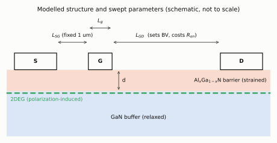
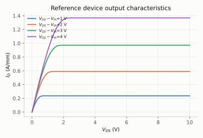
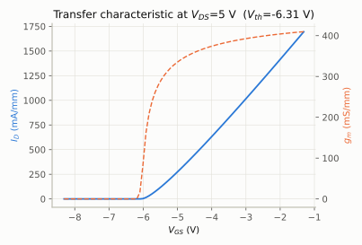
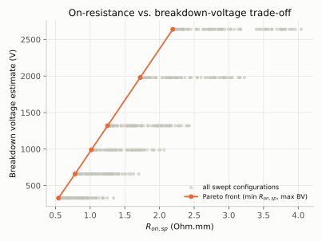
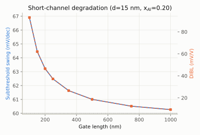
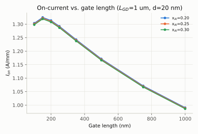

# AlGaN/GaN HEMT Automated Design-Space Exploration Framework

A reproducible, physics-based framework for exploring how AlGaN/GaN HEMT
geometry and composition trade off against each other — gate length,
gate-drain access length, barrier thickness, and Al mole fraction — evaluated
against closed-form and self-consistent analytical device physics, not TCAD.

[](https://github.com/fatinnihal532-hub/algan-gan-hemt-dse/actions/workflows/ci.yml)
[](https://colab.research.google.com/github/fatinnihal532-hub/algan-gan-hemt-dse/blob/main/run_in_colab.ipynb)

<picture>
  <source media="(prefers-color-scheme: dark)" srcset="results/device_cross_section_dark.svg">
  
</picture>

**Headline result:** across 432 swept configurations, every design on the
on-resistance/breakdown-voltage Pareto front uses the shortest gate and the
highest Al fraction available, and buys breakdown voltage mainly through
the gate-drain spacing, at a cost in Ron,sp set by the access-region sheet
resistance. The framework recovers that design rule from a search, not from
an assumption.

**This is an analytical/numerical compact model, not a TCAD simulation.**
Every reported number in this repository comes from the equations in
`src/`, evaluated in Python. No Silvaco, Sentaurus, or any other TCAD tool
was run to produce any figure or table here. `docs/methodology.md` explains
exactly where the model is rigorous closed-form device physics and where it
uses a documented, labelled simplification in place of a full 2D/TCAD solve.

## Problem statement

Choosing a HEMT's gate length, gate-drain spacing, barrier thickness, and Al
composition is a multi-parameter trade-off: what improves on-current and
transconductance (short gate, thin barrier, high Al content) typically costs
subthreshold control, DIBL, or breakdown voltage. Evaluating this trade-off
properly usually means either running many expensive TCAD simulations, or
reasoning about the individual mechanisms qualitatively. This project builds
a fast, closed-form, self-consistent model that can sweep hundreds of
configurations in a few seconds, extract the same figures of merit a TCAD
post-processing script would, and surface the resulting Pareto front —
turning "which structure is best?" into a search over an actual design space
rather than a comparison of two or three hand-picked structures.

## Motivation

My undergraduate thesis ("Influence of Gate Architecture and Gate Position on
the Performance of AlGaN/GaN HEMTs") used Silvaco TCAD to compare three
specific gate structures. That comparison is valuable but necessarily
narrow — three structures, chosen by hand, each requiring a full TCAD run.
This project asks a different question: instead of comparing a few
structures someone picked, can a lightweight analytical model expose the
*shape* of the whole design space at once, cheaply enough to search it
automatically? That is a different kind of contribution (a search/DSE tool)
built on the same physical grounding (polarization-induced 2DEG formation in
AlGaN/GaN) as the thesis, not a re-run of it.

## Objectives

1. Implement the polarization-induced 2DEG charge-control model
   (Ambacher et al.) self-consistently, including the Fermi-level closure
   that a purely linear MOS-style charge-control treatment omits.
2. Build a DC drain-current model on top of it, incorporating velocity
   saturation and source/drain access resistance — a real Ron-vs-BV trade-off
   mechanism, not an assumed one.
3. Extract the standard HEMT figures of merit (Vth, gm,max, subthreshold
   swing, DIBL, Ion, Ioff, Ion/Ioff, Ron,sp, breakdown-voltage estimate) from
   the simulated I-V characteristics, the same way they would be read off a
   measured or TCAD curve.
4. Sweep gate length, gate-drain spacing, barrier thickness, and Al fraction
   over a realistic range, and compute the Pareto-optimal configurations for
   the on-resistance/breakdown-voltage trade-off.
5. Verify every closed-form claim in the model against its own theory
   (`verify.py`), the same discipline used in the author's other three
   simulation repositories.

## Technical background

An AlGaN barrier grown pseudomorphically on relaxed GaN is strained in-plane,
which — combined with the spontaneous polarization mismatch between the two
wurtzite materials — produces a large, fixed sheet of bound polarization
charge at the interface. That charge, not intentional doping, is what pulls
a two-dimensional electron gas (2DEG) into existence on the GaN side of the
junction. This is the mechanism that makes AlGaN/GaN HEMTs possible without
a doped barrier, and it is why a HEMT's threshold voltage and channel charge
depend on barrier thickness and Al content in a way that has no analogue in
a conventional doped-barrier MODFET or a Si MOSFET.

## Methodology (summary — full derivations in `docs/methodology.md`)

| Stage | Physics used | Status |
|---|---|---|
| Polarization charge, `σ(x)` | Ambacher (1999, 2002): spontaneous + piezoelectric polarization from Vegard-law-interpolated lattice/elastic/piezoelectric constants | Closed-form |
| 2DEG sheet density `ns(Vgs)` | Ambacher's linearized charge-control relation, closed self-consistently against a single-subband Fermi-level relation | Self-consistent iteration (fixed-point) |
| Threshold voltage `Vth` | Closed-form (`ns→0` limit of the charge-control relation) | Closed-form |
| Drain current `Id(Vgs,Vds)` | Charge-sheet model with velocity saturation (same structure as the classic velocity-saturated square-law MOSFET model), using the actual `ns(Vgs)` and its numerically-extracted incremental capacitance `Cg(Vgs)` in place of an assumed constant MOS capacitance | Closed-form given `ns(Vgs)` |
| Access resistance | Ungated 2DEG sheet resistance over the source-gate and gate-drain spacings, solved self-consistently against the terminal I-V (bisection) | Closed-form given `ns(0)` |
| Subthreshold swing, DIBL | Empirical proxies keyed to the barrier/gate-length aspect ratio `d_eff/Lg` — the same "scale length" idea used in rigorous short-channel scaling theory, without repeating its full 2D derivation | **Explicitly approximate — see limitations** |
| Breakdown voltage | Parallel-plate estimate, `BV ≈ Ecrit × Lgd` | **Explicitly approximate — see limitations** |

## System architecture

```
materials.py        AlxGa1-xN alloy interpolation: bandgap, polarization,
                     dielectric constant, Schottky barrier
        │
charge_control.py    Self-consistent ns(Vgs) and Vth from the polarization
                     charge-control relation
        │
current_model.py     Id(Vgs,Vds): velocity-saturated charge-sheet model +
                     access resistance (bisection solve) + subthreshold
        │
extraction.py         Vth, gm,max, SS, DIBL, Ion, Ioff, Ron,sp, BV from the
                     simulated characteristics
        │
design_space.py      Full-factorial sweep over (Lg, Lgd, d, x_Al) +
                     Pareto-front extraction
        │
make_figures.py      Regenerates every figure/CSV in results/
verify.py            11 checks against closed-form theory and physical
                     sanity, independent of make_figures.py
```

## Implementation

Pure Python + NumPy + Matplotlib, no proprietary dependencies. `src/` is
about 690 lines across six modules, of which roughly 360 are code and the
rest docstrings and comments that state where each equation comes from.
Each module has a single responsibility (see architecture above). All
physical constants and literature parameters are named module-level
constants in `materials.py`, with their source cited in comments.

## Experimental setup

The sweep in `make_figures.py` and `results/design_space_sweep.csv` covers:

- Gate length `Lg`: 100 – 1000 nm (8 values)
- Gate-drain spacing `Lgd`: 1 – 8 µm (6 values)
- Barrier thickness `d`: 15, 20, 25 nm
- Al mole fraction `x`: 0.20, 0.25, 0.30

That is 432 configurations; the full sweep and every figure regenerate in
about 5 seconds.

## Results

<picture>
  <source media="(prefers-color-scheme: dark)" srcset="results/output_characteristics_dark.svg">
  
</picture>

<picture>
  <source media="(prefers-color-scheme: dark)" srcset="results/transfer_characteristic_dark.svg">
  
</picture>

**Reference device** (Lg=250 nm, Lgd=2 µm, d=20 nm, x=0.25):

| Metric | Value |
|---|---|
| Vth | −6.31 V |
| gm,max | 409 mS/mm |
| Subthreshold swing | 63.4 mV/dec |
| DIBL | 49.2 mV/V |
| Ion | 1.29 A/mm |
| Ron,sp | 1.02 Ω·mm |
| Breakdown voltage (estimate) | 660 V |

Apart from Vth, which is deeper than typical measured devices for a reason
explained in Limitation 7, these are within the range reported for real
AlGaN/GaN HEMTs of similar dimensions — gm,max of a few hundred mS/mm, Ion of order 1 A/mm, subthreshold
swing a little above the 60 mV/dec room-temperature limit — which is the
right sanity check for an analytical model: it should land in a physically
plausible neighborhood, not claim to match one specific fabricated device.

<picture>
  <source media="(prefers-color-scheme: dark)" srcset="results/ron_bv_pareto_dark.svg">
  
</picture>

**On-resistance vs. breakdown-voltage Pareto front** (`results/pareto_front.csv`) — minimize Ron,sp, maximize BV:

| Lg (nm) | Lgd (µm) | d (nm) | x_Al | Ron,sp (Ω·mm) | BV (V) |
|---|---|---|---|---|---|
| 100 | 1 | 20 | 0.30 | 0.544 | 330 |
| 100 | 2 | 20 | 0.30 | 0.783 | 660 |
| 100 | 3 | 25 | 0.30 | 1.017 | 990 |
| 100 | 4 | 25 | 0.30 | 1.252 | 1320 |
| 100 | 6 | 25 | 0.30 | 1.721 | 1980 |
| 100 | 8 | 25 | 0.30 | 2.192 | 2640 |

Every Pareto-optimal point uses the shortest available gate length and the
highest available Al fraction, and trades Ron for BV mainly through Lgd —
the qualitative design rule a power-HEMT engineer would state from first
principles, recovered here from a search rather than assumed.

The one secondary shift is in barrier thickness, from 20 nm on the
low-voltage end of the front to 25 nm from Lgd = 3 µm upward. It has a
physical cause: a thicker barrier holds a slightly denser 2DEG (at x = 0.30,
ns rises from 1.65 to 1.77 × 10¹³ cm⁻² between 15 and 25 nm), which lowers
the access-region sheet resistance from about 252 to 236 Ω/□. Once the
gate-drain spacing is long enough for access resistance to dominate Ron,sp,
that saving outweighs the weaker gate coupling of a thicker barrier.

<picture>
  <source media="(prefers-color-scheme: dark)" srcset="results/ss_dibl_vs_length_dark.svg">
  
</picture>

**Short-channel degradation:**
subthreshold swing and DIBL both degrade monotonically as Lg shrinks below
~500 nm for a 15 nm barrier, and both asymptote to their ideal-channel floor
(60 mV/dec, ~0 mV/V) for Lg ≳ 1 µm — the expected qualitative signature of
short-channel electrostatic loss of control, even though the specific
proxy used to generate it is a simplification (see Limitations).

<picture>
  <source media="(prefers-color-scheme: dark)" srcset="results/ion_vs_length_dark.svg">
  
</picture>

**On-current vs. gate length by Al fraction:**
at a *fixed gate overdrive relative to each configuration's own Vth*, Ion is
close to insensitive to Al fraction — higher Al content increases the
polarization sheet charge but also drives Vth more negative, and the two
effects largely cancel once overdrive rather than absolute Vgs is held
fixed.

Every file in `results/` is generated by CI, not uploaded by hand: on each
push to `main`, GitHub Actions runs `verify.py` and the unit tests, then
`make_figures.py`, and commits the regenerated `results/` back to the
repository (the SVGs are byte-reproducible, so an unchanged model produces
no new commit). Run `python3 make_figures.py` to regenerate everything
locally, or open `run_in_colab.ipynb` to do the same with nothing installed.

## Discussion

The framework recovers, from search rather than assumption, the trade-offs a
power-HEMT designer would expect: shorter gates and higher Al content help
on-state performance; a longer gate-drain access region is the only way in
this model to buy breakdown-voltage headroom, and it costs on-resistance
in direct proportion to that headroom. Making the mechanism behind that
trade-off explicit (access resistance, not just "a bigger number for BV")
is what turns this from a curve-fitting exercise into something defensible:
every number in the Pareto table traces back to a specific physical
mechanism in `current_model.py`.

## Limitations

1. **No TCAD, no Schrödinger-Poisson solve.** The 2DEG's Fermi level uses a
   single-subband, triangular-well approximation instead of a full
   self-consistent quantum solve. This is a standard simplification in
   analytical HEMT charge-control models, but it will not reproduce the
   exact quantized subband structure a Schrödinger-Poisson solver would.
2. **Subthreshold swing and DIBL are modelled as empirical proxies** keyed
   to the barrier/gate-length aspect ratio, not derived from a 2D Poisson
   solve of the actual gate-source-drain geometry. They reproduce the right
   *qualitative* trend (worse for shorter/thinner-barrier devices) but should
   not be read as quantitative predictions for a specific layout.
3. **Breakdown voltage is a parallel-plate estimate** (`Ecrit × Lgd`), which
   ignores field crowding at the gate edge, any field plate, and vertical
   buffer leakage — all of which set the breakdown voltage of a real device
   and require a 2D field solve to capture properly.
4. **No self-heating, no trap/current-collapse dynamics.** Real GaN HEMTs
   show dynamic Ron and thermal derating that this DC, room-temperature
   model does not touch.
5. **The Schottky barrier height vs. Al fraction is a representative linear
   fit**, not a measurement or a fit to one specific reported contact — see
   the docstring in `materials.py`.
6. **SS and DIBL both use the same aspect-ratio proxy**, so in this model
   they are not independently distinguishable; a 2D solve would generally
   show them decoupling as barrier thickness and gate length are varied
   separately.
7. **Threshold voltages are deeper than typical measured devices.** The
   model applies the full theoretical polarization charge `sigma(x)` with no
   compensating surface-donor or interface-trap charge, so Vth comes out
   around −6 V for the reference device and near −10 V for the thickest,
   highest-Al configurations — more negative than the roughly −2 to −5 V
   usually reported for comparable fabricated AlGaN/GaN HEMTs. Trends
   *across* the sweep (thicker barrier or higher Al → more negative Vth)
   follow directly from the physics, but absolute Vth values should not be
   read as predictions. Adding an interface-charge term to `sigma(x)` and
   calibrating it against one published device is the natural first fix.

## Future work

- Replace the empirical SS/DIBL proxies with a scale-length derivation
  (in the spirit of Yan, Ourmazd and Lee's MOSFET scaling analysis)
  specific to the AlGaN/GaN HEMT cross-section.
- Add a 2D field-crowding correction (for example a conformal-mapping
  estimate of the gate-edge field peak) to the breakdown-voltage model, and compare it
  against the parallel-plate estimate here.
- Extend to an AC/RF small-signal model (Cgs, Cgd, ft, fmax) from the same
  charge-control core, to study the RF/breakdown trade-off alongside the
  DC one already here.
- Cross-check a handful of representative points against a 1D
  Schrödinger-Poisson solve of the same heterostructure (a finite-difference
  solver is a tractable addition to this repository), to bound how far the
  single-subband approximation drifts from a fully self-consistent one --
  and, for the thesis-adjacent geometries, against the Silvaco TCAD results
  already in hand.

## Reproducibility

```bash
git clone https://github.com/fatinnihal532-hub/algan-gan-hemt-dse.git
cd algan-gan-hemt-dse
pip install -r requirements.txt

python3 verify.py                          # 11 checks, under a second
python3 make_figures.py                    # regenerates results/, about 5 s
python3 -m unittest discover -s tests -v   # 18 unit tests, under a second
```

Or run it in your browser with nothing installed:

[](https://colab.research.google.com/github/fatinnihal532-hub/algan-gan-hemt-dse/blob/main/run_in_colab.ipynb)

## File layout

```
src/materials.py       AlGaN alloy interpolation and polarization physics
src/charge_control.py  Self-consistent ns(Vgs) and Vth
src/current_model.py   Id(Vgs,Vds) with velocity saturation and access resistance
src/extraction.py      Figure-of-merit extraction from simulated I-V curves
src/design_space.py    Sweep + Pareto-front extraction
verify.py              11 checks against closed-form theory
make_figures.py        Regenerates every figure and CSV in results/
tests/                 18 unit tests covering materials, charge control,
                        current model, and design-space search
docs/methodology.md    Full derivations and every equation used
```

## References

1. O. Ambacher et al., "Two-dimensional electron gases induced by
   spontaneous and piezoelectric polarization in undoped and doped
   AlGaN/GaN heterostructures," *J. Appl. Phys.* 85, 3222 (1999).
2. O. Ambacher et al., "Pyroelectric properties of Al(In)GaN/GaN hetero- and
   quantum well structures," *J. Phys.: Condens. Matter* 14, 3399 (2002).
3. I. Vurgaftman and J. R. Meyer, "Band parameters for nitrogen-containing
   semiconductors," *J. Appl. Phys.* 89, 5815 (2001).
4. B. J. Baliga, "Power semiconductor device figure of merit for
   high-frequency applications," *IEEE Electron Device Lett.* 10, 455 (1989).
5. S. M. Sze and K. K. Ng, *Physics of Semiconductor Devices*, 3rd ed.,
   Wiley, 2007 (velocity-saturated charge-sheet current model).
6. R.-H. Yan, A. Ourmazd and K. F. Lee, "Scaling the Si MOSFET: from bulk
   to SOI to bulk," *IEEE Trans. Electron Devices* 39, 1704 (1992)
   (short-channel scale length -- the rigorous analogue of the aspect-ratio
   proxy used here).

## Author

Fatin Nihal Islam — Electrical & Electronic Engineering, KUET. This
framework extends the polarization-physics grounding of an undergraduate
thesis on AlGaN/GaN HEMT gate architecture into an automated,
multi-parameter design-space search, which is a different kind of work
from the thesis's TCAD comparison of a handful of hand-picked structures.

## License

MIT
